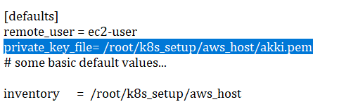

# What to Do ==>>
## Must Read It First...

1. Change you AWS Credentials in the file **aws**.

2. Make Sure your AWS Instances have tag names : `master` for Master Node and `worker` for Worker Node. (**Case-Sensitive**)

3. Change inside `ansible.cfg` file.
   - In default Section You have to provide your **ssh_privae_key_file_name** in place of **akki.pem**
   - Like : `private_key_file= /root/k8s_setup/aws_host/your_key.pem`.
   - Paste **ansible.cfg** to `/etc/ansible/ansible.cfg` in your System.
   
   
   
   
4. You have to change some more things to make it work properly. (**Read Instructions Carefully**)
   - Go Inside **aws_host** folder.
   - Go inside **files** folder of Both **master** and **worker** folder.
   
5. Don't Change Any other File.

## Where to store.. =>>
- Download complete folder **k8s_setup** and paste it to `/root` location.
- Must change you **Ansible Configuration** file with Above mentioned file.

## Now =>
1. Run `bash aws` command first. If your playbook fail to run then also run this command first then try to run playbook.
2. You can Run **master.yml** file to Configure **kubernetes Master Node** using `ansible-playbook master.yml` command.
3. You can Run **worker.yml** file to Configure **kubernetes Worker Node** using `ansible-playbook worker.yml` command.
